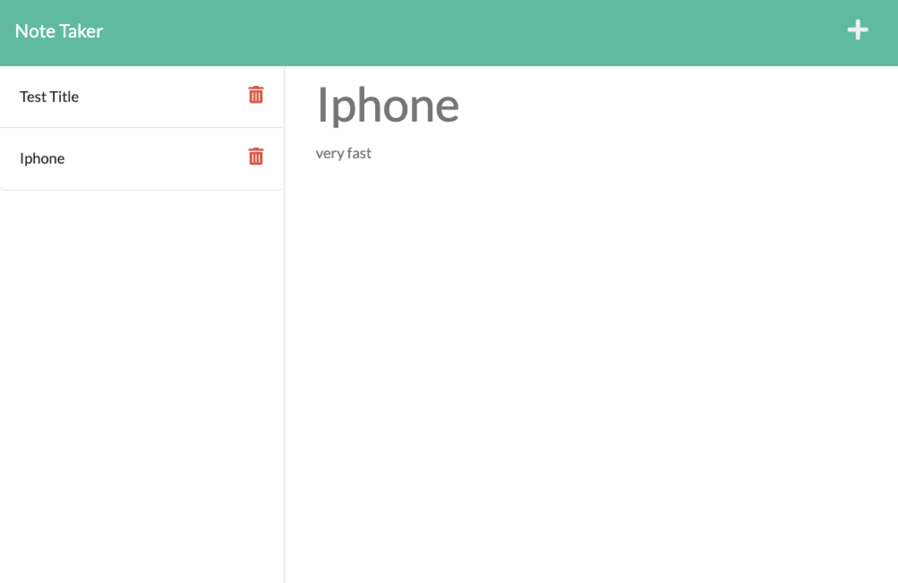

# Easy Note Taker

## Description
   This note taker app allows you to write, save and delete note in a very convenient way. 
   The main problem is using Heroku to deploy the app. 
## Table of Contents
1. [Installation](#installation)
2. [Usage](#usage)
3. [License](#license)
4. [Contributing](#contributing)
5. [Tests](#tests)
6. [Questions](#questions)
## Installation
   N/A
## Usage
   
   - URL of GitHub Repo: https://github.com/Kayexie/easy-to-note
   - URL of Application: https://drive.google.com/file/d/
## License
   N/A
## Contributingß
   N/A
## Tests
   N/A
## Questions
   - Please refer to https://github.com/Kayexie.
   - You can also sent emails to xiekaye@gmail.com for more questions.